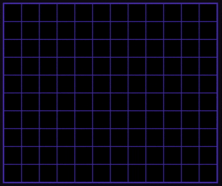
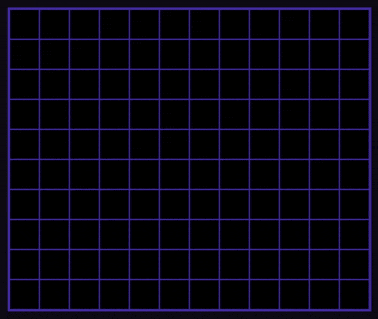
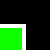
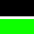
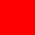
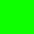
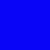
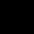
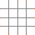

# Wave Function Collapse
Procedural image generation using an algorithm rooted in quantum mechanics. 
Visit: https://quinnbooth.github.io/Wave-Function-Collapse/
  

  
   
  <em>Figure 1: Blob image set.</em>

  

  
   
  <em>Figure 2: Farm image set.</em>

## Author

👨‍💻 **Quinn Booth** - `qab2004@columbia.edu`
  

## How to Use

Visit the aforementioned webpage. Select an image preset on the left, or upload your own. Then click the "GENERATE" button! You may adjust the dimensions of the grid using the height and width fields. Additionally, you can toggle between fast and slow generation modes using the speed button.  

## Uploading Custom Images

When you visit the webpage linked above, you will notice an image set selector on the left side. As you scroll down within the selector, you will come across an upload button. Clicking on this button will open a menu that allows you to select multiple PNG files from your computer. Once you have selected your desired set of images, upload them all at once. 

An additional image set has been included in this repository specifically for testing the custom upload feature. You can locate it in the "images/box" directory. It's important to note that unlike the other image sets available, this collection of PNG files is not a pre-defined preset; the script isn't aware of its existence before you upload it. The following images exist within the test set: 

|  |  |  |  |  |
|-----|-----|-----|-----|-----|
|  |  |  |  |  | 

When creating your own image set, there are some rules to keep in mind. First, all PNGs must be 50x50 pixels. Secondly, it is assumed that each uploaded image has at least one valid neighbor for each of its sides. The program uses RGB values along each side of the images to determine which PNGs (in various orientations) can be neighbors. Here's how it works, treating the upper left pixel as (0, 0): 

- For the top edge, the program samples points (12, 0), (25, 0), and (37, 0).
- For the right edge, the program samples points (49, 12), (49, 25), and (29, 37).
- For the bottom edge, the program samples points (12, 49), (25, 49), and (37, 49).
- For the left edge, the program samples points (0, 12), (0, 25), and (0, 37). 

By analyzing these RGB readings, the program determines which PNG images can be neighbors with each other. Let's consider an example scenario: Suppose we have a tile with RGB readings 'red, blue, red' on its right side. In order for another image to be its right-hand neighbor, the RGB readings on the left side of the second image must match those of the first tile (its right-hand readings). This matching pattern ensures that the images can seamlessly connect with each other in the generated output. Below is an image showing the important pixels in red. You can find this PNG in "images/README" and use it as a template.
  

  
   
  <em>Figure 3: PNG specifications.</em>

 

# How it Works

Wave Function Collapse is an algorithmic technique used for procedurally generating non-repetitive images or 3D structures. It is inspired by the principles of quantum mechanics, where a wave function collapse occurs when a wave function reduces to a single eigenstate through interaction with its surroundings. In the context of computation, this concept is applied by calculating constraints between neighboring items and using them to generate a coherent structure. 

This project operates within a 2D context, where each box in the grid initially possesses the same level of entropy, indicating the number of potential images that can occupy its position. By randomly selecting boxes with the minimum entropy, we assign an image to one of them, leading to its "wave function collapse." As a result, additional constraints are imposed on the surrounding boxes. This pattern of collapsing boxes and applying constraints is repeated in a loop until all boxes have collapsed, ultimately resulting in the completion of the image. 

Initially, the program loads a preset of images or the ones you uploaded into a list. Then, it generates rotations of each image. Only the rotations that are unique from the original and previous rotations are considered acceptable orientations. Each remaining rotated image is associated with a Cell object, which also stores the RGB identifiers for each side of the image. The process of determining these identifiers is explained in the "Uploading Custom Images" section above. Finally, we iterate through the Cell objects to determine which cells can be neighbors, and this information is stored within each cell. 

Once the cells have been prepared, a matrix is generated with dimensions matching the grid on the screen. Each coordinate in the matrix corresponds to a Box object. These Box objects are initially set to allow any image within their bounds. As mentioned before, a box is selected from the boxes with the least entropy, and a possible cell/image is randomly assigned to it. This leads to a reduction in the set of possible images allowed in the surrounding boxes. A heuristic is implemented to prevent any neighboring cell from being left with zero possible images after the box undergoes Wave Function Collapse. This process is repeated until all boxes have been filled. In the event of a dead end, where a box cannot be assigned a valid image, the process restarts. 

Wave function collapse is a fascinating algorithm for creative and unique procedural generation. Please enjoy testing this model out and hopefully you are inspired to make a similar project of your own!